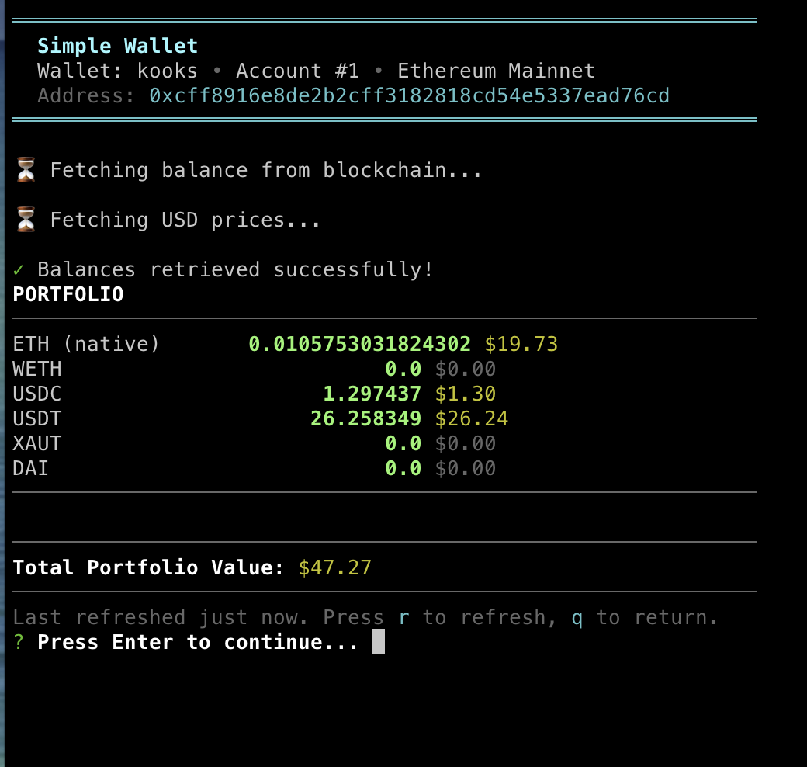
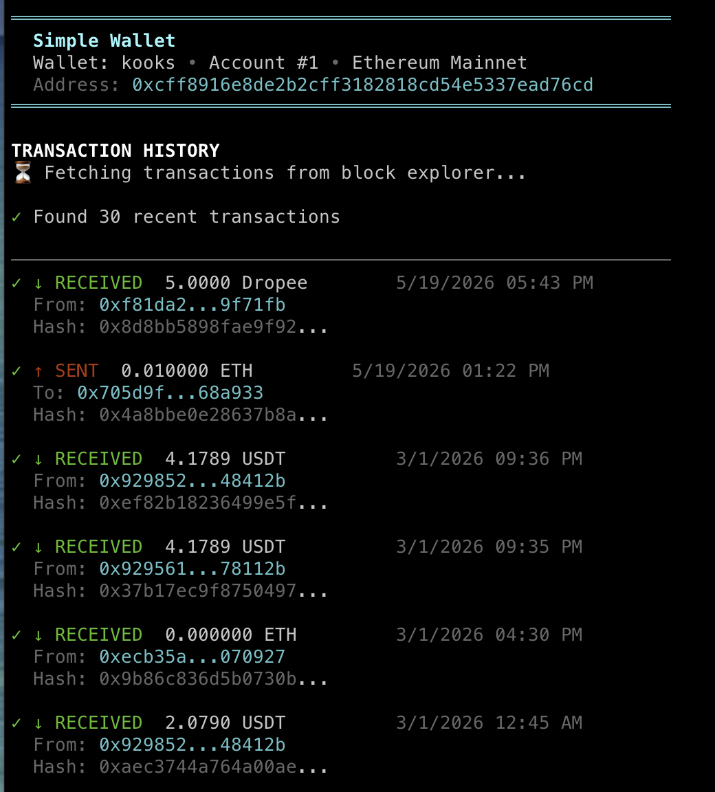
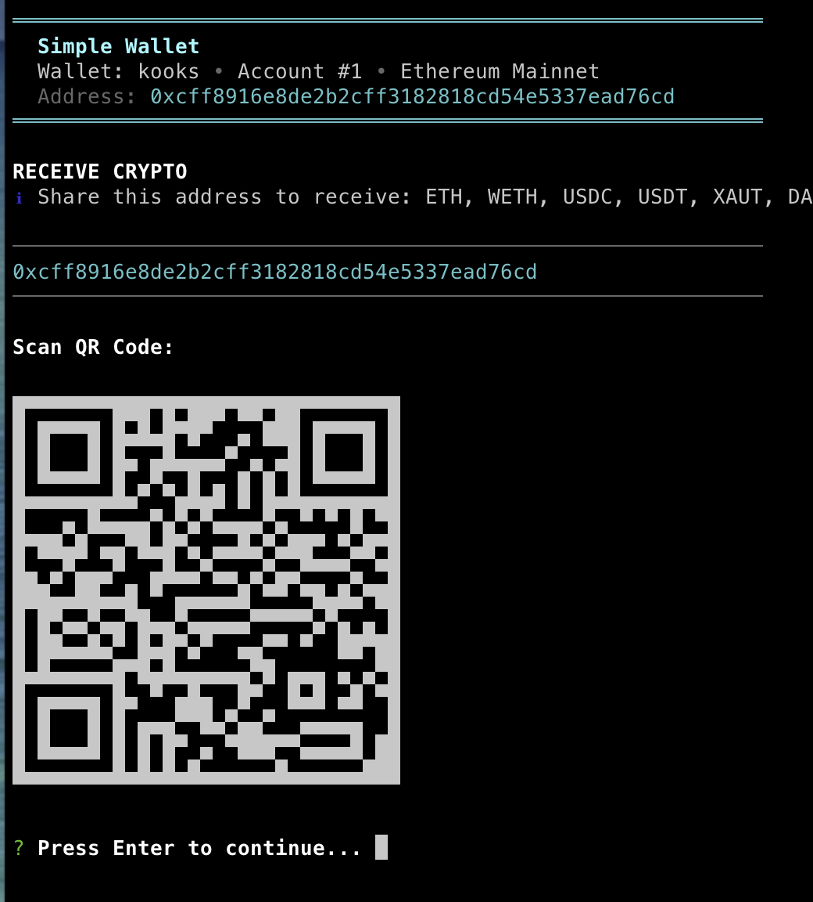
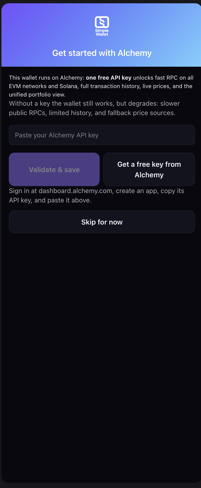
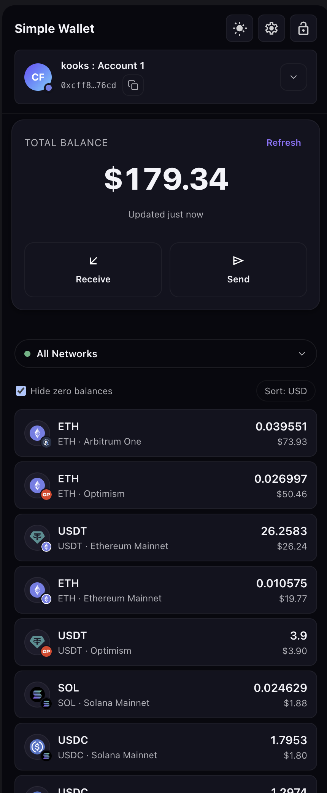
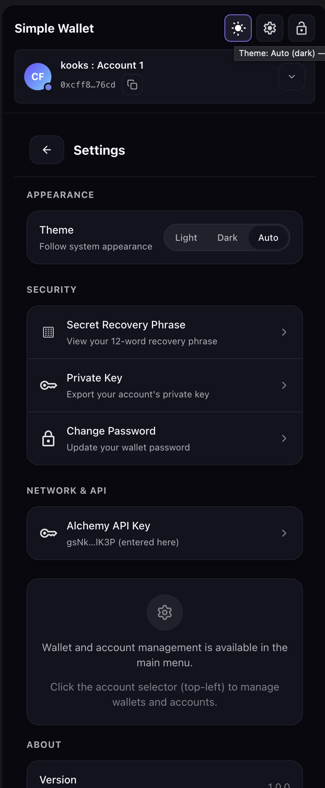
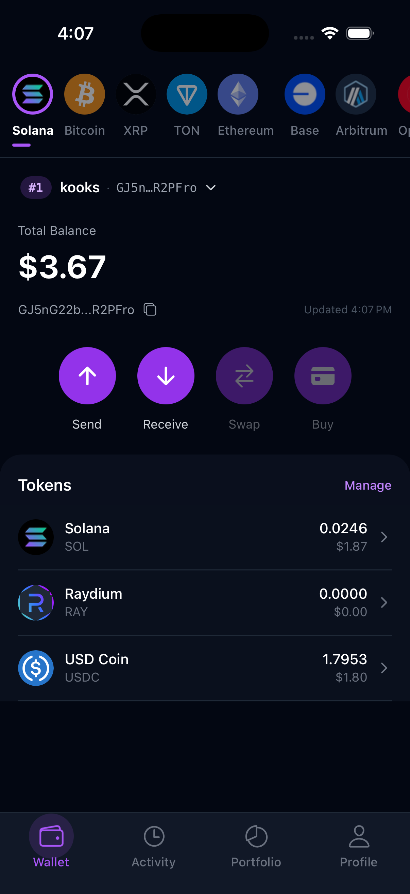
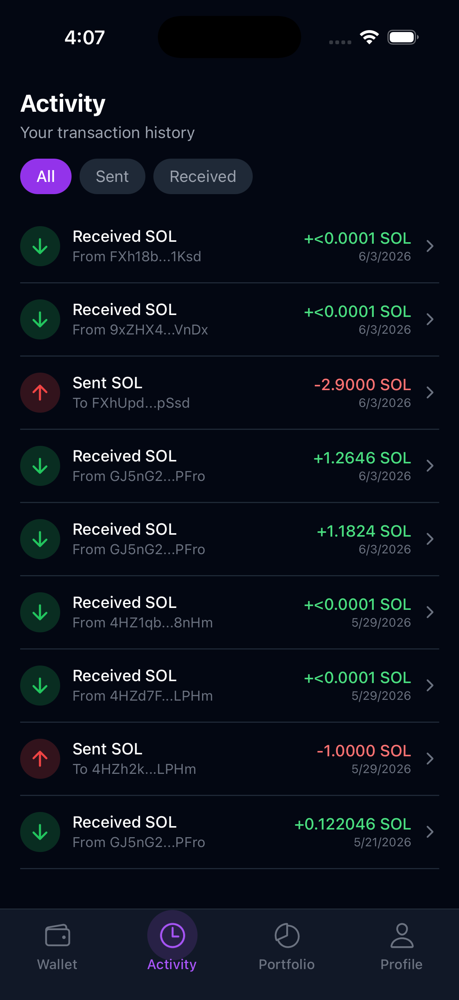
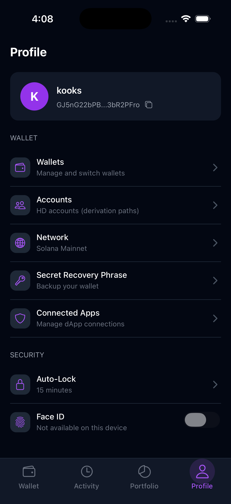

# Simple Wallet

[](./LICENSE)
[](https://www.alchemy.com/)
[](#platforms)
[](#supported-chains)

**A multi-chain wallet built on [Alchemy](https://www.alchemy.com/). One API key
powers RPC (EVM + Solana), transaction history, prices, and portfolio data —
across a CLI, a Chrome extension, and a mobile app, all from one shared
TypeScript core.**

If you're learning how to build on Alchemy, this repo doubles as a working
reference: real, production-shaped code showing the Alchemy JSON-RPC,
Transfers, Prices, and Portfolio Data APIs working together across nine EVM
chains plus Solana — see
**[How Simple Wallet uses Alchemy](./docs/alchemy.md)** for a guided tour
with links straight into the code.

## How it works

- **One key, many chains.** A single `ALCHEMY_API_KEY` serves nine EVM networks
  and Solana — the hostname selects the chain, so there's no per-chain key
  sprawl. ([details](./docs/alchemy.md#the-one-key-many-chains-model))
- **Four Alchemy products, working together:**
  - **JSON-RPC** — balances, token reads, gas, and sends (EVM + Solana)
  - **Transfers API** — `alchemy_getAssetTransfers` for transaction history
  - **Prices API** — first-priority USD token prices
  - **Portfolio Data API** — balances + prices + metadata in a single call
- **Three UIs, one core.** The same integration code backs the CLI, extension,
  and mobile app — the shared TypeScript core in `src/` handles everything
  chain-related, and each UI just wires up platform adapters.
- **Graceful fallback.** Alchemy is preferred everywhere; public RPC, Etherscan
  V2, and CoinGecko fill gaps without changing callers.

## Getting Started

**Prerequisites:** Node.js 18+ and npm.

```bash
git clone https://github.com/akramh/simple-wallet.git
cd simple-wallet
npm install
```

You don't need any configuration to try it: on first launch each app walks you
through entering an Alchemy API key (or getting a free one at
[dashboard.alchemy.com](https://dashboard.alchemy.com/)), validates it live,
and saves it for you. That single key powers balances, history, and prices
across every supported EVM chain and Solana. To configure up front instead,
`cp .env.example .env` and set `ALCHEMY_API_KEY` — everything else in that
file is optional.

### CLI

```bash
npm run dev
```

An interactive terminal wallet: create or import a wallet, then check your
portfolio, send, receive, and browse history from the menu.

<p align="center">
  
  
  
</p>

### Chrome extension

```bash
npm run build:extension
```

Then open `chrome://extensions/`, enable **Developer mode**, click **Load
unpacked**, and select `dist-extension/`. On first open the extension offers
the Alchemy key setup; you can also bake a key into the build with
`VITE_ALCHEMY_API_KEY`. Details: [docs/platforms/extension.md](./docs/platforms/extension.md).

<p align="center">
  
  
  
</p>

### Mobile app (Expo)

```bash
cd mobile-wallet
npm install
npx expo prebuild --clean
npx expo run:ios        # or: npx expo run:android
```

Wallet unlock uses native crypto (`react-native-quick-crypto`), so a
**development build is required — Expo Go won't work**. Use `npx expo start`
alone only for Metro/UI iteration. Environment setup, physical-device installs,
and build details: [docs/platforms/mobile.md](./docs/platforms/mobile.md).

<p align="center">
  
  
  
</p>

## Platforms

- **CLI** — Node.js entrypoint at `src/index.ts`
- **Chrome extension** — Manifest V3 extension under `extension/`
- **Mobile app** — Expo + React Native app under `mobile-wallet/`
- **SDK** — Node and browser entrypoints exported from `src/sdk.ts` and
  `src/sdk-browser.ts`

## Supported Chains

- **EVM** — Ethereum, Sepolia, Base, Arbitrum, Optimism, Polygon, Avalanche,
  BNB Smart Chain, Linea *(Alchemy RPC + Transfers/Portfolio/Prices)*
- **Solana** — mainnet and devnet *(Alchemy RPC)*
- **Bitcoin** — mainnet and testnet *(mempool.space)*
- **XRP Ledger** — mainnet and testnet *(xrpl WebSocket)*
- **TON** — mainnet and testnet *(Toncenter)*

## Documentation

All detailed project documentation lives under `docs/`.

- **[How Simple Wallet uses Alchemy](./docs/alchemy.md)** — the Alchemy integration tour
- [Documentation index](./docs/README.md)
- [Getting started](./docs/getting-started.md)
- [Architecture](./docs/architecture.md)
- [API reference](./docs/api-reference.md)
- [Development workflow](./docs/development.md)
- [Testing](./docs/testing.md)
- [Security](./docs/security.md)
- [External APIs and environment variables](./docs/external-apis-and-env.md)
- [CLI](./docs/platforms/cli.md)
- [Chrome extension](./docs/platforms/extension.md)
- [Mobile app](./docs/platforms/mobile.md)
- [License compliance](./docs/legal/license-compliance.md)
- [Third-party licenses](./docs/legal/third-party-licenses.md)

## Core Commands

```bash
npm run build              # Compile TypeScript to dist/
npm run type-check         # Type-check root project
npm test                   # Build and run root node:test suite
npm run build:extension    # Build dist-extension/
npm run watch:extension    # Rebuild extension on change
```

Mobile commands run from `mobile-wallet/`:

```bash
npm start                  # Start Expo
npm run ios                # Run iOS development build
npm run android            # Run Android development build
npm run typecheck          # Type-check mobile app
npm test                   # Run Jest tests
```

## Contributing

Contributions are welcome. See [CONTRIBUTING.md](./CONTRIBUTING.md) for the dev
setup, build/test loops, and the security expectations for wallet changes.

## Security

This is wallet software. Treat mnemonic phrases, private keys, wallet backups,
and platform storage carefully. The security invariants are documented in
[docs/security.md](./docs/security.md); review them before touching storage,
crypto, signing, dApp approvals, or network/RPC behavior. To report a
vulnerability, see [SECURITY.md](./SECURITY.md).

## License

MIT. See [LICENSE](./LICENSE).
