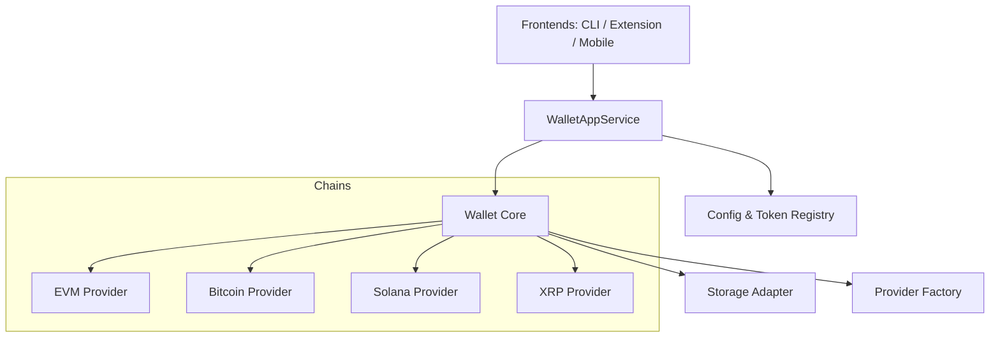

# Core SDK Documentation

## Overview

The Core SDK (`src/`) is the heart of the project, providing a platform-agnostic library for managing multi-chain wallets. It allows for wallet creation, key derivation, balance checking, and transaction signing across Ethereum (and EVM chains), Bitcoin, Solana, and XRP.

It is designed to be used in three distinct environments:
1.  **Node.js CLI**: Uses `fs` for storage and Node's `crypto` module.
2.  **Chrome Extension**: Uses `chrome.storage` and WebCrypto.
3.  **Mobile App (React Native)**: Uses `AsyncStorage`/`SecureStore` and a highly optimized C++ crypto binding (`react-native-quick-crypto`).

## Architecture

The architecture follows a layered service-oriented pattern:



### Key Components

#### 1. `WalletAppService` (`src/app-service.ts`)
The main entry point for any UI. It orchestrates high-level operations:
-   **Lifecycle**: `createWallet`, `unlockWallet`, `loadWallet`.
-   **State**: Manages the "active" wallet and network.
-   **Registry**: Handles token lists (built-in `tokens.json` + user-defined `tokens-user.json`).
-   **Orchestration**: Routes requests (like `getPortfolio`) to the appropriate chain provider.

#### 2. `Wallet` (`src/wallet.ts`)
Handles the sensitive cryptographic operations and HD (Hierarchical Deterministic) derivation.
-   **Encryption**: Encrypts the master mnemonic using AES-256-GCM.
-   **Derivation**: Derives private keys and addresses for different chains using BIP-44 paths.
    -   EVM: `m/44'/60'/0'/0/x`
    -   Bitcoin: `m/84'/0'/0'/0/x` (Native SegWit)
    -   Solana: `m/44'/501'/x'/0'`
    -   XRP: `m/44'/144'/x'/0/0`

#### 3. Providers (`src/providers.ts` & `src/<chain>/provider.ts`)
Abstracts network interactions.
-   **EVM**: Wraps `ethers.js` providers.
-   **Bitcoin**: Custom implementation using Mempool.space API.
-   **Solana**: Wraps `@solana/web3.js` and Helius/Solscan APIs.
-   **XRP**: Wraps `xrpl.js` (WebSocket client).

#### 4. Adapters
To support multiple platforms, we use dependency injection for system interfaces:
-   **`StorageAdapter`**: `FileStorage` (Node), `ChromeStorage` (Extension), `MobileStorage` (RN).
-   **`CryptoAdapter`**: Node `crypto`, WebCrypto, or `react-native-quick-crypto`.

## Directory Structure

```text
src/
├── app-service.ts       # Main Service Facade
├── wallet.ts            # Core Wallet Logic (Keys/Encryption)
├── providers.ts         # Provider Factory
├── storage.ts           # Storage Interface & File/Memory Adapters
├── crypto-adapter.ts    # Crypto Interface & Node/Web Adapters
├── price-service.ts     # Token price fetching & caching
├── transaction-history.ts # Cross-chain transaction history
├── bitcoin/             # Bitcoin Module (Address, Tx, Explorer)
├── solana/              # Solana Module
├── xrp/                 # XRP Module
├── ethereum/            # Ethereum Helpers
└── types/               # Shared TypeScript Types
```

## Key Flows

### Wallet Creation
1.  User provides a password.
2.  `Wallet` generates a random BIP-39 mnemonic.
3.  Mnemonic is encrypted with the password (PBKDF2 derivation + AES-256-GCM).
4.  Encrypted blob is saved via `StorageAdapter`.

### Multi-Chain Transaction
1.  UI calls `walletAppService.sendTransaction()`.
2.  Service identifies the current active network (e.g., "solana-mainnet").
3.  Service requests the specific chain module to build the transaction.
4.  `Wallet` derives the private key for that chain/index.
5.  Transaction is signed and broadcast via the chain's Provider.

## Adding a New Chain
To add a new chain (e.g., Litecoin):
1.  Create `src/litecoin/` with address derivation and provider logic.
2.  Update `src/wallet.ts` to handle the new BIP-44 path.
3.  Update `src/config.json` to include the network definition.
4.  Update `src/app-service.ts` to expose the new capabilities.
