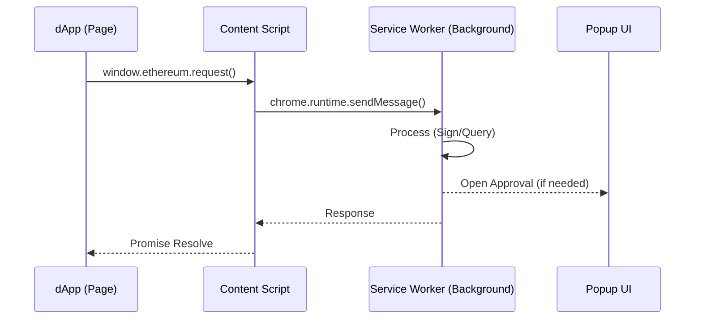

# Chrome Extension Documentation

## Overview

The Chrome Extension brings the Simple Crypto Wallet to the browser, enabling dApp interactions (via EIP-1193) and providing a convenient popup UI. It uses **Manifest V3** and React.

## Architecture

The extension is composed of three isolated contexts that communicate via message passing:

### 1. Background Service Worker (`background/service-worker.ts`)
This is the "server" of the extension. It runs persistently (or wakes up on events) and holds the wallet state.
-   **Session Management**: Keeps the wallet "unlocked" in memory using an obfuscated session password.
-   **Auto-Lock**: Timers lock the wallet after 15 minutes of inactivity.
-   **SDK Host**: Instantiates the `WalletAppService` with `ChromeStorageAdapter`.
-   **RPC Handler**: Processes JSON-RPC requests (`eth_sendTransaction`, `eth_accounts`) from dApps.

### 2. Content Script & Provider (`content/`)
-   **`injected.ts`**: Injects the `window.ethereum` object into the DOM.
-   **`provider.ts`**: Implements the EIP-1193 standard. It forwards requests from the page to the Content Script via `window.postMessage`, which then relays them to the Background.

### 3. Popup UI (`popup/`)
A React application (built with Vite) that provides the visual interface.
-   **State**: Syncs with the Background script. It doesn't hold the private keys itself; it asks the Background to perform actions.
-   **Components**:
    -   `WelcomeScreen`: Onboarding.
    -   `UnlockScreen`: Password entry.
    -   `MainWallet`: Dashboard, Send, Receive.
    -   `NetworkSelector`: Switch chains.

## Key Features

-   **Persistent State**: Uses `chrome.storage.local` to save encrypted wallet data (compatible with the CLI's JSON format).
-   **dApp Connection**: Supports connecting to websites (e.g., Uniswap) on supported EVM chains.
-   **Notifications**: Uses Chrome Notifications for TX status (optional implementation).
-   **Side Panel**: Includes a Side Panel view for a persistent wallet experience alongside web browsing.

## Build System

-   **Tool**: Vite
-   **Config**: `vite.config.extension.ts`
-   **Outputs**: `dist-extension/`
    -   `service-worker.js`
    -   `popup.html` & assets
    -   `content-script.js`

## Security Considerations

-   **Memory Storage**: The decrypted mnemonic is held in memory in the Service Worker.
-   **CSP**: Strict Content Security Policy prevents inline scripts.
-   **Origin Checks**: The background script verifies the sender of messages to prevent unauthorized access.
