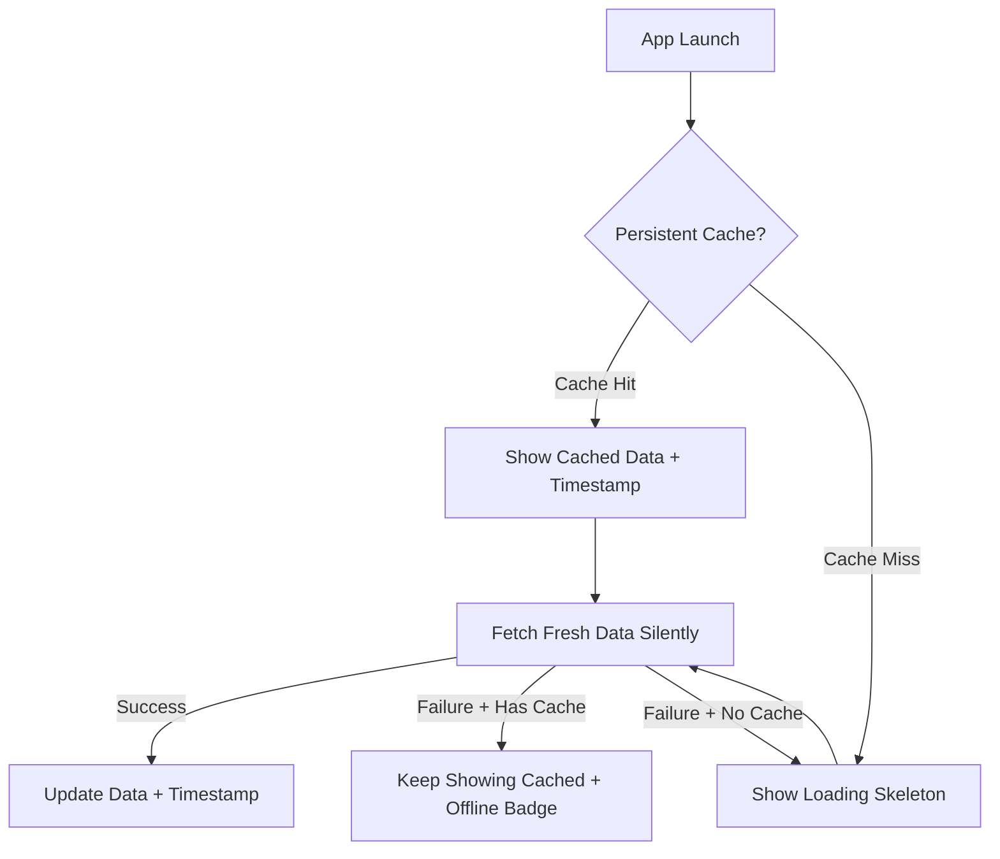
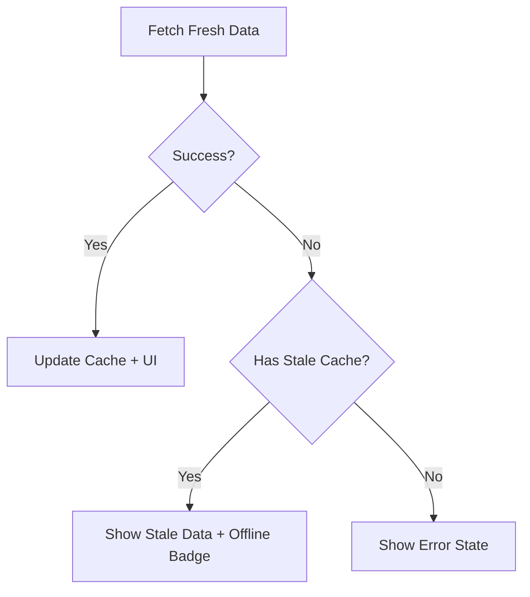

# Caching Strategy for Mobile Wallet Balances

**Status**: Planned  
**Created**: December 2025

## Overview

Implement a MetaMask-style persistent caching strategy for the mobile wallet. Show cached balances immediately on app launch with an "Updated X ago" timestamp. Refresh silently in the background without blocking spinners.

## Problem Statement

Currently, when the mobile wallet launches or refreshes, it:

1. Clears any previous balance state
2. Makes a blocking API call to fetch balances
3. Only displays data after the API returns

This causes unnecessary delays - users see an empty or loading state for 1-5 seconds on every app launch, even if their balance hasn't changed.

## Proposed Solution: MetaMask-Style Stale-While-Revalidate

Implement a **persistent** caching layer (survives app restarts) that follows MetaMask's UX pattern:

1. **Shows cached data immediately** - Display last-known balances instantly on app launch (no spinner)
2. **Shows "Updated X ago" timestamp** - Users know the data's age without intrusive indicators
3. **Refreshes silently in background** - Fetch fresh data without blocking UI or showing spinners
4. **Updates UI seamlessly** - Data just updates when fresh data arrives
5. **Falls back gracefully** - Show "Offline" indicator when network unavailable

### Key UX Principles (from MetaMask)

- **No blocking spinners** when cached data exists
- **Timestamp indicates freshness** ("Updated 2 min ago" or "Updated 10:30 AM")
- **Silent background refresh** - UI just updates when ready
- **Offline resilience** - Show cached data with "Offline" indicator



## Architecture Changes

### 1. New Cache Service (`services/CacheService.ts`)

A dedicated service to manage persistent caching with TTL and staleness tracking:

```typescript
interface CachedData<T> {
  data: T;
  cachedAt: number;      // Timestamp when cached
  ttlMs: number;         // Time-to-live in ms
  version: number;       // Schema version for invalidation
}

class CacheService {
  // Get cached data (returns null if expired or missing)
  get<T>(key: string): CachedData<T> | null;
  
  // Get even if expired (for stale-while-revalidate)
  getStale<T>(key: string): CachedData<T> | null;
  
  // Set with TTL
  set<T>(key: string, data: T, ttlMs: number): void;
  
  // Invalidate specific keys or patterns
  invalidate(keyOrPattern: string | RegExp): void;
  
  // Check freshness
  isFresh(key: string): boolean;
}
```

### 2. TTL Configuration

| Data Type | TTL | Rationale |
|-----------|-----|-----------|
| Balances | 2 minutes | Balances can change frequently from external transfers |
| Prices | 5 minutes | Prices are fetched from aggregators with their own caching |
| Transactions | 5 minutes | Historical data changes less often |
| Token Lists | 24 hours | Static configuration data |

### 3. Cache Key Schema

Keys will follow this pattern for proper invalidation:

```
cache:{walletName}:{accountIndex}:{networkKey}:{dataType}
```

Examples:

- `cache:default:0:ethereum-mainnet:balances`
- `cache:default:0:ethereum-mainnet:prices`
- `cache:global:tokenList`

### 4. Invalidation Events

Cache is invalidated when:

- **Transaction sent** - Invalidate balances for the current network
- **Network switched** - No invalidation (each network has separate cache)
- **Account switched** - No invalidation (each account has separate cache)
- **Pull-to-refresh** - Force refresh bypasses cache
- **App foreground** - Check staleness, refresh if stale

## Implementation Files

### Modified Files

1. **`services/WalletBridge.ts`**

   - Add `getCachedBalances()` method for sync reads
   - Modify `refreshBalances()` to write to persistent cache
   - Add `refreshBalancesInBackground()` for non-blocking updates

2. **`store/walletStore.ts`**

   - Load cached balances on `initialize()` before showing loading
   - Add `loadCachedBalances()` action
   - Add `balancesCacheStatus: 'fresh' | 'stale' | 'loading' | 'error'` state

3. **`hooks/useBalances.ts`**

   - Return `cacheStatus` for UI indicators
   - Auto-refresh in background when stale

4. **`app/(tabs)/wallet.tsx`**

   - Remove floating "Refreshing balances..." indicator
   - Keep existing "Updated HH:MM" timestamp (already present)
   - Add "Offline" indicator when network unavailable
   - Only show loading skeleton on first launch (no cache)

### New Files

5. **`services/CacheService.ts`** - New cache management service

## UI Behavior Changes (MetaMask-Style)

| Scenario | Current Behavior | New Behavior |
|----------|------------------|--------------|
| App launch (cache exists) | Loading spinner, empty list | Show cached data immediately + "Updated 5 min ago" |
| App launch (no cache) | Loading spinner | Loading skeleton (same) |
| Background refresh | Floating "Refreshing..." indicator | Silent - just update data when ready |
| Pull-to-refresh | Spinner, then update | Native RefreshControl only, then update |
| Network failure | Error state | Show cached data + "Offline" badge |
| After transaction | Manual refresh needed | Auto-invalidate, silent background refresh |

### Visual Example

```
+-------------------------------------+
|  Total Balance                      |
|  $1,234.56                          |
|  Wallet . 0x1234...5678             |
|                   Updated 2 min ago |  <- Subtle timestamp (no spinner)
+-------------------------------------+
|  [Send]  [Receive]  [Swap]  [Buy]   |
+-------------------------------------+
|  Tokens                             |
|  +--------------------------------+ |
|  | ETH     0.5000      $1,200.00  | |
|  | USDC    34.56       $34.56     | |
|  +--------------------------------+ |
+-------------------------------------+

When offline:
+-------------------------------------+
|  Offline . Updated 10:30 AM         |  <- Shows when network unavailable
+-------------------------------------+
```

### What We Remove

- Floating "Refreshing balances..." pill indicator
- `ActivityIndicator` during background refresh
- Any blocking UI during refresh when cache exists

## Error and Fallback Handling



Fallback priority:

1. Fresh cached data (TTL not expired)
2. Stale cached data with "Offline" indicator
3. Error state with retry button (only if no cache exists)

## Testing Strategy

New tests required:

- `CacheService.test.ts` - TTL logic, invalidation patterns
- `useBalances.test.tsx` - Cache status transitions
- Update `walletStore.test.ts` - Cache loading on initialize

## Security Notes

- Balance and price data is NOT sensitive - safe to cache in AsyncStorage
- Wallet encryption keys remain in SecureStore (no change)
- Cache cleared on wallet lock (optional, based on preference)

## Implementation Checklist

- [ ] Create CacheService with TTL, staleness tracking, and invalidation
- [ ] Add getCachedBalances() and background refresh methods to WalletBridge
- [ ] Load cached balances on initialize(), add cacheStatus state to store
- [ ] Return cacheStatus from useBalances, trigger background refresh when stale
- [ ] Show "Updated X ago" timestamp, remove floating refresh indicator from UI
- [ ] Add unit tests for CacheService and integration tests for cache flows

